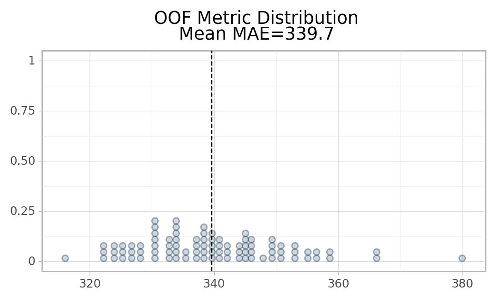
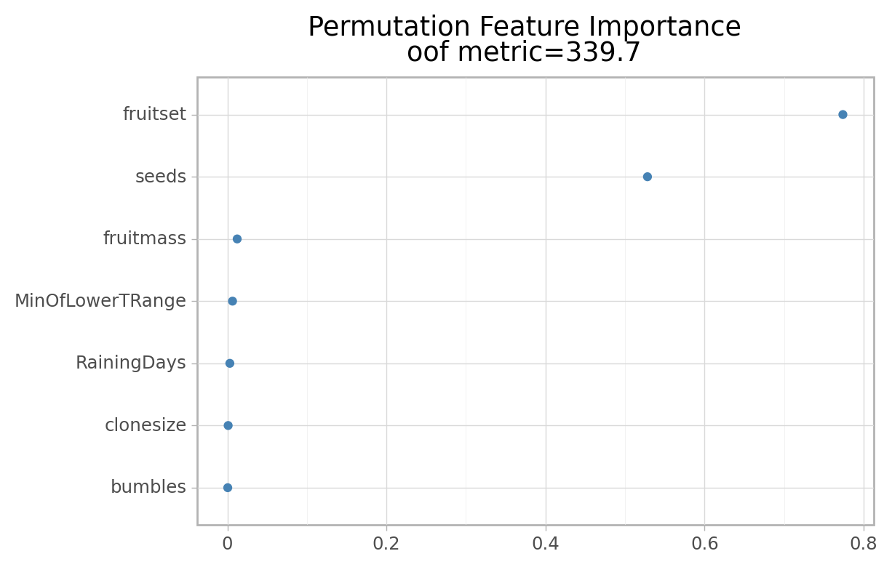
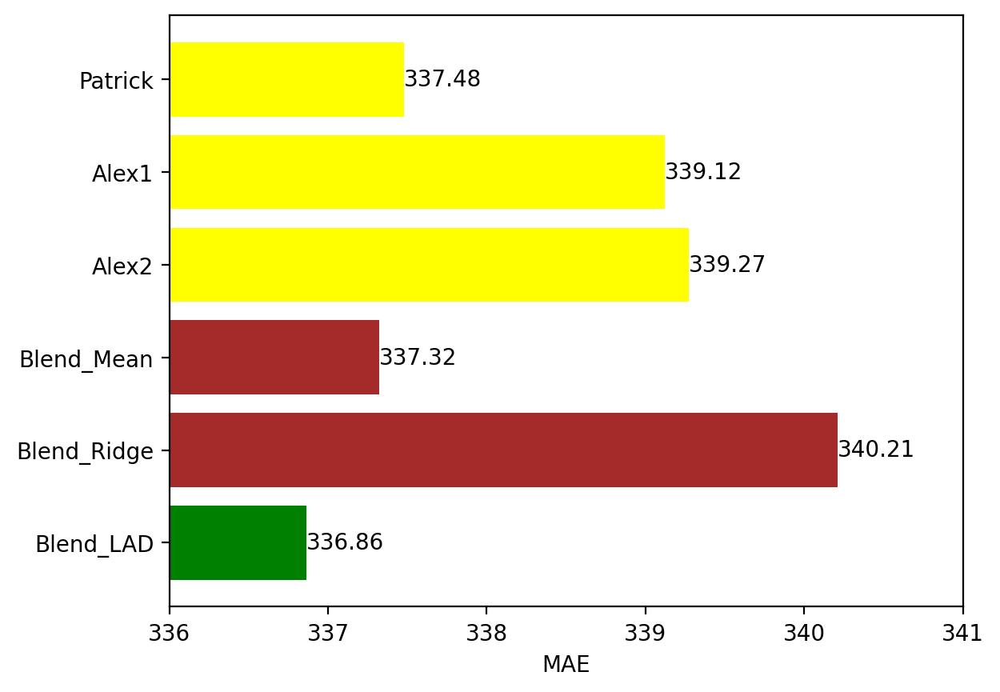

# **Prediction of Wild Blueberry Yield** | Kaggle Competition | Top 1.5% Leaderboard
## **Introduction**
This data science project is focused on regression analysis, specifically using the LADRegression model and LightGBM (Gradient Boosting) model. The project involves feature engineering, hyperparameter tuning, and evaluating the model's performance.

The project begins with code for data preprocessing, including handling missing values and modifying specific columns in the train and test datasets. Additionally, some data exploration and visualization are performed to gain insights into the data.

Next, there are code snippets related to feature engineering. The MyFeaturesEngineering class is defined as a custom transformer that applies Principal Component Analysis (PCA) and Partial Least Squares (PLS) regression to the specified features. The fit method of this class fits the PCA and PLS models to the data, while the transform method applies the transformations to the data.

The fit_lgbm function is used to train a LightGBM model. It takes various parameters such as the model's hyperparameters, the number of splits for cross-validation, and the features to use. Within the function, the data is split into training and validation sets using K-fold cross-validation. The MyFeaturesEngineering transformer is applied to the data, and the LightGBM model is trained and evaluated for each fold. The function returns the out-of-fold predictions, validation scores, and other metrics.

The code snippets involving the params dictionary define the hyperparameters for the LightGBM model. Different configurations are used in separate calls to the fit_lgbm function, where the model is trained with different sets of features and settings.

Finally, there is code related to hyperparameter tuning using grid search. An instance of the LADRegression model is created, and a grid search object is initialized with the hyperparameters to search. The grid search object is fitted to the data using cross-validation, and the best hyperparameters and corresponding score are printed.

## **Import required libraries**


```python
import os
import warnings
import subprocess
import importlib

def import_or_install(package):
        try:
            importlib.import_module(package)
            print(f'{package} is already installed')
        except ImportError:
            print(f'{package} is not installed, installing now...')
            subprocess.check_call(['pip', 'install', package])
            print(f'{package} has been installed')

warnings.filterwarnings('ignore')
import_or_install('flaml')
import_or_install('plotnine')
import_or_install('sklego')

import math
import numpy as np
import pandas as pd
pd.set_option('display.max_rows', 50)

from pathlib import Path
import random

from plotnine import * 

from sklearn.inspection import permutation_importance
from sklearn.model_selection import KFold, StratifiedKFold, train_test_split
from sklearn.metrics import mean_absolute_error

from flaml import AutoML
from flaml.automl.model import LGBMEstimator

from sklearn.base import TransformerMixin, BaseEstimator
from sklearn.pipeline import make_pipeline, Pipeline
from sklearn.compose import ColumnTransformer

from sklearn.preprocessing import StandardScaler
from sklearn.decomposition import PCA
from sklearn.cross_decomposition import PLSRegression

import lightgbm as lgb

from sklego.linear_model import LADRegression
from sklearn.linear_model import Ridge

from sklearn.model_selection import GridSearchCV

import matplotlib.pyplot as plt

%matplotlib inline
%config InlineBackend.figure_format='retina'

INPUT_DIR = Path('/kaggle/input/playground-series-s3e14/')
```

## **Data Preprocessing**

This code initializes various variables and sets up the necessary configurations for performing nested cross-validation with specific parameters and randomization settings.


```python
TARGET_NAME = 'yield'

N_OUTER_FOLDS = 9
N_FOLDS = 10
N_REPEATS = 10


FIRST_TIME_BUDGET = 1 
MIN_TIME_BUDGET = 1 

INCLUDE_ORIGINAL = True

RANDOM_STATE = 42 

np.random.seed(RANDOM_STATE)
```

test_data = pd.read_csv(INPUT_DIR / 'test.csv'): This line reads the CSV file named 'test.csv' located in the directory specified by INPUT_DIR using the Pandas read_csv function. The resulting data is stored in the test_data variable.

test_data['data_type'] = 0: This line adds a new column named 'data_type' to the test_data DataFrame and sets all values in that column to 0.

train_data = pd.read_csv(INPUT_DIR / 'train.csv'): This line reads the CSV file named 'train.csv' from the specified directory and assigns the data to the train_data variable.

train_data['data_type'] = 0: This line adds a new column named 'data_type' to the train_data DataFrame and sets all values in that column to 0.

if INCLUDE_ORIGINAL: ...: This block checks if the variable INCLUDE_ORIGINAL is True. If so, it reads another CSV file named 'WildBlueberryPollinationSimulationData.csv' and assigns it to the original_data variable. It also adds a 'data_type' column with a value of 1 to the original_data DataFrame. Then, it concatenates the original_data DataFrame (excluding the 'Row#' column) with the train_data DataFrame using pd.concat, and assigns the result back to train_data.

features = ...: This line defines a list of feature column names. It includes specific columns like 'MinOfLowerTRange', 'RainingDays', 'fruitmass', 'fruitset', 'seeds', 'bumbles', and 'clonesize'. The inclusion of 'data_type' in the list depends on the value of INCLUDE_ORIGINAL.

def fe(df): ...: This line defines a function named 'fe' that takes a DataFrame as input. Inside the function, there's a couple of conditional assignments to modify the values in the 'RainingDays' column of the DataFrame.

fe(train_data): This line calls the 'fe' function on the train_data DataFrame, applying the modifications defined in the function to the 'RainingDays' column.

fe(test_data): This line calls the 'fe' function on the test_data DataFrame, applying the same modifications to the 'RainingDays' column.


```python
test_data = pd.read_csv(INPUT_DIR / 'test.csv')
test_data['data_type'] = 0

train_data = pd.read_csv(INPUT_DIR / 'train.csv')
train_data['data_type'] = 0

if INCLUDE_ORIGINAL:
    original_data = pd.read_csv('/kaggle/input/wild-blueberry-yield-prediction-dataset/WildBlueberryPollinationSimulationData.csv')
    original_data['data_type'] = 1
    train_data = pd.concat([train_data, original_data.drop(columns=['Row#'])]).reset_index(drop=True)


features = (['MinOfLowerTRange', 'RainingDays', 'fruitmass', 'fruitset', 'seeds', 'bumbles', 'clonesize']
            +  ([] if INCLUDE_ORIGINAL else ['data_type']))

def fe(df):
    # a couple of rows seem odd 
    # probably not enough to make much of a difference
    df['RainingDays'] = np.select(
        condlist=[
            df['RainingDays'] == 26, 
            df['RainingDays'] == 33],
        choicelist= [24, 34],
        default=df['RainingDays'])
    
fe(train_data)
fe(test_data)
```

This code defines a post-processing function named mattop_post_process that takes a sequence of predictions as input. Inside the function, it modifies each prediction by finding the closest value from the unique target values obtained from the training data. This post-processing step can be useful for refining predictions to align them more closely with the available target values.


```python
unique_targets = np.unique(train_data["yield"])
def mattop_post_process(preds):
     return np.array([min(unique_targets, key = lambda x: abs(x - pred)) for pred in preds])
```

### **Exploratory Analysis**


```python
train_data.filter(features).describe().T
```


<div>
<style scoped>
    .dataframe tbody tr th:only-of-type {
        vertical-align: middle;
    }

    .dataframe tbody tr th {
        vertical-align: top;
    }

    .dataframe thead th {
        text-align: right;
    }
</style>
<table border="1" class="dataframe">
  <thead>
    <tr style="text-align: right;">
      <th></th>
      <th>count</th>
      <th>mean</th>
      <th>std</th>
      <th>min</th>
      <th>25%</th>
      <th>50%</th>
      <th>75%</th>
      <th>max</th>
    </tr>
  </thead>
  <tbody>
    <tr>
      <th>MinOfLowerTRange</th>
      <td>16066.0</td>
      <td>28.661988</td>
      <td>3.195960</td>
      <td>24.300000</td>
      <td>27.000000</td>
      <td>30.000000</td>
      <td>30.000000</td>
      <td>33.000000</td>
    </tr>
    <tr>
      <th>RainingDays</th>
      <td>16066.0</td>
      <td>18.643737</td>
      <td>11.680365</td>
      <td>1.000000</td>
      <td>16.000000</td>
      <td>16.000000</td>
      <td>24.000000</td>
      <td>34.000000</td>
    </tr>
    <tr>
      <th>fruitmass</th>
      <td>16066.0</td>
      <td>0.446525</td>
      <td>0.037200</td>
      <td>0.311921</td>
      <td>0.418867</td>
      <td>0.446570</td>
      <td>0.474777</td>
      <td>0.535660</td>
    </tr>
    <tr>
      <th>fruitset</th>
      <td>16066.0</td>
      <td>0.502711</td>
      <td>0.074639</td>
      <td>0.192732</td>
      <td>0.457833</td>
      <td>0.506686</td>
      <td>0.560709</td>
      <td>0.652144</td>
    </tr>
    <tr>
      <th>seeds</th>
      <td>16066.0</td>
      <td>36.162894</td>
      <td>4.048407</td>
      <td>22.079199</td>
      <td>33.232449</td>
      <td>36.047770</td>
      <td>39.158238</td>
      <td>46.585105</td>
    </tr>
    <tr>
      <th>bumbles</th>
      <td>16066.0</td>
      <td>0.286556</td>
      <td>0.060249</td>
      <td>0.000000</td>
      <td>0.250000</td>
      <td>0.250000</td>
      <td>0.380000</td>
      <td>0.585000</td>
    </tr>
    <tr>
      <th>clonesize</th>
      <td>16066.0</td>
      <td>19.659374</td>
      <td>6.618134</td>
      <td>10.000000</td>
      <td>12.500000</td>
      <td>25.000000</td>
      <td>25.000000</td>
      <td>40.000000</td>
    </tr>
  </tbody>
</table>
</div>


## **Data Modeling**
### **Flaml**
This code includes several functions and a class related to the AutoML (Automated Machine Learning) process. Here's a breakdown of what each part does:

**fold_mae(y, preds, data_type)**: This function calculates the mean absolute error (MAE) between the target values (y) and predictions (preds) for a specific data_type. It filters the data based on the data_type condition to evaluate the competition training data only.

**get_fi(automl, estimator_name, X, y)**: This function extracts the permutation feature importance from a trained AutoML model (automl). It creates an empty DataFrame fi to store the feature importance results. It attempts to extract the importance using permutation_importance for two scenarios: if the AutoML model is an ensemble (specifically using LightGBM) or if it's a single estimator. If successful, it populates the fi DataFrame with the feature importances and assigns the estimator_name. Finally, it returns the fi DataFrame.

**class AutoMLFitter**: This class serves as a wrapper for the AutoML process. It allows decreasing the time budget for each call and keeps track of the best parameters found.

**def __init__(self, name, time_budget, estimator_list=[], best_config=None, n_folds=10)**: This method initializes the AutoMLFitter class. It assigns values to the name, time_budget, estimator_list, best_config, and n_folds attributes.

**def fit_automl(self, random_state, X, y)**: This method performs the AutoML fitting process. It sets up the automl_settings dictionary with various configuration options such as the time budget, evaluation metric, task type, ensemble usage, cross-validation settings, and more. The time budget is decreased for each fitting iteration, and if it falls below the minimum time budget (MIN_TIME_BUDGET), it is set to the minimum value. An AutoML instance is created, a learner is added, and the fitting process is executed using the provided data (X, y) and the automl_settings. The best configuration per estimator is stored, and the trained AutoML object is returned.


```python
def fold_mae(y, preds, data_type):
    # evaluate against competition training data only
    return mean_absolute_error(y[data_type==0], preds[data_type==0])

def get_fi(automl, estimator_name, X, y):
    # extract permutation feature importance
    # from the model.
    
    fi = pd.DataFrame({
        'estimator_name': [],
        'Feature': [],
        'Importance': []})
    
    try:
        # ensemble - use lgbm
        est = automl.model.named_estimators_['lgbm']
        imp = permutation_importance(est, X, y)
        fi = pd.DataFrame({
            'Importance': imp.importances_mean,
            'Feature': X.columns})
    except:
        try:
            est = automl.model
            imp = permutation_importance(est, X, y)
            fi = pd.DataFrame({
                'Importance': imp.importances_mean,
                'Feature': X.columns})
        except:
            pass
    
    if len(fi) > 0:
        fi = fi.assign(estimator_name=estimator_name)
    
    return fi


class AutoMLFitter:
    # A wrap of the automl call to allow us to
    # decrease the time budget for each call
    # And keep track of the best parameters found
    
    def __init__(self, name, time_budget, estimator_list=[], best_config=None, n_folds=10):
        self.name = name
        self.time_budget = time_budget
        self.estimator_list = estimator_list
        self.best_config = best_config
        self.n_folds = n_folds

    def fit_automl(self, random_state, X, y):

        automl_settings = {
            "time_budget": self.time_budget,
            "metric": 'mae',
            "task": 'regression',
            "log_file_name": "",
            "ensemble": False,
            "eval_method": 'cv',
            "n_splits": self.n_folds,
            "seed": random_state,
            "verbose": 0,
            "estimator_list": self.estimator_list
        }

        # time budget is decreased on each fit.
        self.time_budget //= 1.5
        if self.time_budget < MIN_TIME_BUDGET:
            self.time_budget = MIN_TIME_BUDGET

        automl = AutoML()
        automl.add_learner(learner_name='my_lgbm', learner_class=MyLGBM)
        automl_settings["estimator_list"] = ['my_lgbm' ]  # change the estimator list
        
        automl.fit(X, y, starting_points=self.best_config, **automl_settings)
        self.best_config = automl.best_config_per_estimator

        return automl
```

This code includes two functions related to the fitting process of nested AutoML models. Here's a breakdown of what each part does:

**def fit_nested_automl(model_fitters, random_state, train_data, test_data, features)**: This function performs the fitting of nested AutoML models. It takes a list of model_fitters (instances of the AutoMLFitter class), a random_state value, the train_data and test_data DataFrames, and a list of features as inputs.

It sets up a KFold object with N_OUTER_FOLDS splits for cross-validation.
Initializes empty lists and arrays for storing fast feature importance, out-of-fold metrics, test predictions, and out-of-fold predictions.
Then, it enters a loop over the train/test indices generated by the KFold object.
Inside this loop, it performs the fitting process for each model_fitter in the model_fitters list. It fits the AutoML model using the fit_automl method of the AutoMLFitter class, passing the random state, filtered training data, and target values.
It calculates the out-of-fold and test predictions for each model, and updates the aggregate predictions and metrics.
It also calls the get_fi function to extract fast feature importances for each model and appends them to the fast_fis list.
After the loop, it calculates the fold-wise mean absolute error (oof_metric) using the fold_mae function.
It prints the oof_metric for each fold and updates the overall out-of-fold predictions and metrics.
Finally, it returns the out-of-fold predictions, test predictions, fast feature importances, and out-of-fold metrics.

**def fit(model_fitters, train_data, test_data, features)**: This function performs the fitting process of nested AutoML models. It takes a list of model_fitters (instances of the AutoMLFitter class), train_data, test_data DataFrames, and a list of features as inputs.

It initializes empty arrays and lists for storing test predictions, out-of-fold predictions, out-of-fold metrics, out-of-fold fold-wise metrics, and fast feature importances.
It enters a loop for N_REPEATS iterations, each time with a different random_state value.
Inside the loop, it calls the fit_nested_automl function to perform the nested AutoML fitting process, passing the relevant arguments.
It calculates the overall out-of-fold metric (oof_metric) and the out-of-fold metric after post-processing the predictions (oof_metric_pp) using the fold_mae function.
It updates the aggregate predictions and metrics.
It prints the oof_metric and oof_metric_pp for each repetition.
Finally, it returns the out-of-fold predictions, test predictions, out-of-fold fold-wise metrics, and fast feature importances.


```python
def fit_nested_automl(model_fitters, random_state, train_data, test_data, features):
                               
    k_fold = KFold(n_splits=N_OUTER_FOLDS, random_state=random_state, shuffle=True)
    
    fast_fis = []
    oof_metrics = []
    test_preds = np.zeros(len(test_data))
    oof_preds = np.zeros(len(train_data))
    
    print('OOF Metric: ', end='')
    for train_index, test_index in k_fold.split(train_data, train_data[TARGET_NAME]):
        tr, vl = train_data.loc[train_index], train_data.loc[test_index]
        
        # for each model:
        oof_pred = np.zeros(len(vl))
        test_pred = np.zeros(len(test_data))
        best_loss = 0
        
        for model_fitter in model_fitters:
            
            automl = model_fitter.fit_automl(
                random_state, 
                tr.filter(features), 
                tr[TARGET_NAME].values)
        
            oof_pred  += automl.predict(vl.filter(features)) / len(model_fitters)
            test_pred += automl.predict(test_data.filter(features)) / len(model_fitters)
            best_loss += automl.best_loss / (len(model_fitters))
        
            fast_fi =  get_fi(automl, model_fitter.name, vl.filter(features), vl[TARGET_NAME])
            fast_fis.append(fast_fi)
        
        oof_metric = fold_mae(
            vl[TARGET_NAME].values, 
            oof_pred, 
            vl['data_type'].values)
        
        print(f'{oof_metric:4.1f}', end=' ')
        
        oof_preds[test_index] += oof_pred
        test_preds += test_pred / N_OUTER_FOLDS
        fast_fis.append(fast_fi)
        oof_metrics.append(oof_metric)

    return oof_preds, test_preds, fast_fis, oof_metrics


def fit(model_fitters, train_data, test_data, features):
    test_preds = np.zeros(len(test_data))
    oof_preds = np.zeros(len(train_data))
    oof_metrics = []
    oof_fold_metrics = []
    fast_fis = []
    for i in range(N_REPEATS): 
        # fit
        oof_pred, test_pred, fast_fi, oof_fold_metric = fit_nested_automl(
            model_fitters,
            RANDOM_STATE + i,
            train_data.sample(frac=1),
            test_data,
            features)

        oof_metric = fold_mae(
            train_data[TARGET_NAME].values, 
            oof_pred, 
            train_data['data_type'].values)
        
        oof_metric_pp = fold_mae(
            train_data[TARGET_NAME].values, 
            mattop_post_process(oof_pred), 
            train_data['data_type'].values)

        test_preds += (test_pred) / N_REPEATS
        oof_preds += (oof_pred) / N_REPEATS

        oof_fold_metrics.extend(oof_fold_metric)
        fast_fis.extend(fast_fi)

        print(f'| Repeat {i}: {oof_metric:4.1f} mattop postprocessing {oof_metric_pp:4.1f}')
        
    return oof_preds, test_preds, oof_fold_metrics, fast_fis
```

### **Train AutoML Model**
This code prepares and fits a single AutoML model with a specific time budget, hyperparameter configuration, and number of folds for nested cross-validation. It then prints the best configuration and proceeds to fit the model on the entire training data, generating predictions and metrics.


```python
tr = train_data.sample(frac=1, random_state=RANDOM_STATE)

model_fitter = AutoMLFitter(
    name='model',
    time_budget= FIRST_TIME_BUDGET, 
    n_folds=5) # nested CV: 8/9 * 9/10 = 80%, equivalent to 5 folds

# here's one I made earlier:
# running the fitter with a longer budget will discover these 
# hyperparameters:
model_fitter.best_config = {
    'my_lgbm': {'n_estimators': 265, 'num_leaves': 93, 'min_child_samples': 20, 
                'learning_rate': 0.05533790147941807, 'log_max_bin': 10, 
                'colsample_bytree': 0.8809128870084636, 'reg_alpha': 0.0009765625, 
                'reg_lambda': 0.015589408048174165}}

model_fitter.fit_automl(
    RANDOM_STATE, 
    tr.filter(features), 
    tr[TARGET_NAME].values)

model_fitter.time_budget = MIN_TIME_BUDGET
model_fitter.n_folds = N_FOLDS

print(model_fitter.best_config)

models = [model_fitter]
# model fit & output
oof_preds, test_preds, oof_fold_metrics, fast_fis = fit(models, train_data, test_data, features)
```

    {'my_lgbm': {'n_estimators': 265, 'num_leaves': 93, 'min_child_samples': 20, 'learning_rate': 0.05533790147941807, 'log_max_bin': 10, 'colsample_bytree': 0.8809128870084636, 'reg_alpha': 0.0009765625, 'reg_lambda': 0.01558940804817417}}
    OOF Metric: 341.1 343.8 322.7 337.7 333.3 352.6 333.8 344.6 345.7 | Repeat 0: 339.5 mattop postprocessing 339.3
    OOF Metric: 334.4 353.4 354.7 334.2 353.5 339.8 322.6 326.4 338.1 | Repeat 1: 339.7 mattop postprocessing 339.5
    OOF Metric: 330.6 338.3 345.8 380.0 324.9 342.6 328.5 332.4 338.2 | Repeat 2: 340.1 mattop postprocessing 339.9
    OOF Metric: 333.2 343.6 366.3 324.3 339.5 327.9 344.8 345.5 330.7 | Repeat 3: 339.5 mattop postprocessing 339.4
    OOF Metric: 349.1 346.1 344.8 330.2 330.1 333.9 333.5 341.3 349.3 | Repeat 4: 339.8 mattop postprocessing 339.7
    OOF Metric: 321.8 356.2 333.0 358.9 330.7 336.8 334.3 350.8 341.7 | Repeat 5: 340.5 mattop postprocessing 340.3
    OOF Metric: 316.1 330.8 350.8 330.9 356.9 324.3 326.3 366.1 349.2 | Repeat 6: 339.1 mattop postprocessing 338.9
    OOF Metric: 345.2 350.7 340.5 325.1 346.3 327.2 335.7 334.3 349.6 | Repeat 7: 339.4 mattop postprocessing 339.3
    OOF Metric: 347.9 339.9 336.7 338.4 358.5 341.9 338.5 328.2 323.6 | Repeat 8: 339.3 mattop postprocessing 339.2
    OOF Metric: 339.4 335.3 341.1 325.8 338.7 355.6 336.8 344.7 340.0 | Repeat 9: 339.7 mattop postprocessing 339.5


### **Model Performance**
df_metrics = pd.DataFrame({'oof': oof_fold_metrics}): This line creates a DataFrame df_metrics using the list of out-of-fold fold-wise metrics oof_fold_metrics.

print(ggplot(df_metrics, aes(x='oof')) + ...): This block creates a plot using the ggplot library. It sets the aesthetics, theme, and size of the plot, adds a dot plot of the metric distribution, includes a dashed line representing the mean of the metrics, and adds appropriate labels and title.

df_importance = pd.concat(fast_fis).sort_values(['Importance']): This line concatenates the list of fast feature importance DataFrames fast_fis into a single DataFrame df_importance and sorts it based on the 'Importance' column.

if len(df_importance) > 0: ...: This block checks if df_importance is not empty and proceeds to generate a feature importance plot.

df_importance_mean = ...: This block calculates the mean and standard deviation of feature importances across different models. It sorts the DataFrame by the mean importance and assigns category labels to the features. It also calculates the minimum and maximum bounds for the mean importance.

df_importance = df_importance.merge(df_importance_mean.filter(['Feature', 'feature_cat'])): This line merges df_importance with the filtered columns of df_importance_mean, which include the feature, feature category, mean importance, and standard deviation.

print(ggplot(df_importance, aes(y='feature_cat', x='Importance')) + ...): This block creates a plot showing the permutation feature importance. It sets the aesthetics, theme, and size of the plot, adds points representing the mean importance for each feature, and includes appropriate labels and title.

if len(df_importance) > 0: ...: This block checks if df_importance is not empty and proceeds to print the top 20 features along with their mean importance and standard deviation.


```python
df_metrics = pd.DataFrame({'oof': oof_fold_metrics})
print(ggplot(df_metrics, aes(x='oof'))
    + theme_light()
    + theme(figure_size=(6, 3))
    + geom_dotplot(alpha=0.3, binwidth = 1, fill='SteelBlue')
    + geom_vline(xintercept=np.mean(oof_fold_metrics), linetype='dashed')
    + labs(
        y = '', x='', 
        title = f'OOF Metric Distribution\nMean MAE={np.mean(oof_fold_metrics):4.1f}'))

df_importance = pd.concat(fast_fis).sort_values(['Importance'])
if len(df_importance) > 0:
    df_importance_mean = (
        df_importance
        .groupby(['Feature'], as_index=False)
        .agg(mean_imp=('Importance', 'mean'), std_imp=('Importance', 'std'))
        .sort_values(['mean_imp']))

    feature_list = df_importance_mean['Feature'].tolist()
    feature_cat  = pd.Categorical(df_importance_mean['Feature'], categories=feature_list) #[::-1])
    
    df_importance_mean = (df_importance_mean
        .assign(
            feature_cat = feature_cat,
            mean_imp_min = lambda x: x['mean_imp'] - 2 * x['std_imp'],
            mean_imp_max = lambda x: x['mean_imp'] + 2 * x['std_imp']))
    
    df_importance = df_importance.merge(df_importance_mean.filter(['Feature', 'feature_cat']))

    print(ggplot(df_importance, aes(y='feature_cat', x='Importance')) 
        + theme_light()
        + theme(figure_size=(6, 4))
        #+ geom_jitter(alpha=0.2, size=0.5, height=0.1)
        + geom_point(mapping=aes(x='mean_imp'), colour='SteelBlue', data=df_importance_mean) 
        #+ geom_errorbarh(
        #    mapping=aes(x='mean_imp', xmin='mean_imp_min', xmax='mean_imp_max'), 
        #    alpha=0.5,  data=df_importance_mean)  
        + labs(
            y = '', x='', 
            title = (f'Permutation Feature Importance\n'
                f'oof metric={np.mean(oof_fold_metrics):4.1f}'))
        #+ facet_wrap('estimator_name', ncol=2)
         )
    
if len(df_importance) > 0:
    print(df_importance_mean.filter(['Feature', 'mean_imp', 'std_imp']).head(20))
```


    

    


    


    

    


    
                Feature  mean_imp   std_imp
    2           bumbles  0.000422  0.000389
    3         clonesize  0.000948  0.000684
    1       RainingDays  0.003067  0.000931
    0  MinOfLowerTRange  0.006432  0.001249
    4         fruitmass  0.012293  0.002582
    6             seeds  0.528243  0.030693
    5          fruitset  0.773959  0.051585


### **LGBM**
This code defines a wrapper class called PLSRegressionWrapper that extends the functionality of PLSRegression from scikit-learn. The wrapper class provides two additional methods: transform and fit_transform.

**transform(self, X)**: This method overrides the transform method of the parent class. It takes an input matrix X and calls the transform method of the parent class (super().transform(X)) to perform the transformation using Partial Least Squares Regression.

**fit_transform(self, X, Y)**: This method overrides the fit_transform method of the parent class. It takes input matrices X and Y and performs both fitting and transformation. It calls the fit method of the parent class (self.fit(X, Y)) to fit the model to the data, and then calls the transform method of the parent class (self.transform(X)) to apply the learned transformation to X.


```python
SEED = 1984
target = "yield"

class PLSRegressionWrapper(PLSRegression):
    def transform(self, X):
        return super().transform(X)
    def fit_transform(self, X, Y):
        return self.fit(X,Y).transform(X)
```

#### **Preprocressing for LGBM**
This code performs some data preprocessing steps on the train, test, and origin dataframes.

The first block of code modifies the "RainingDays" column in the train and test dataframes. It replaces the values 26 with 24 in the "RainingDays" column of the train dataframe and replaces the values 33 with 34 in the "RainingDays" column of the test dataframe. This code is used to handle specific values in the "RainingDays" column that need to be adjusted.

The second block of code modifies the "MaxOfUpperTRange" column in the train, test, and origin dataframes. It replaces certain values in the "MaxOfUpperTRange" column with the value 86. Specifically, it replaces the values 71.9, 79, and 89 with 86 in all three dataframes.

The third block of code displays the value counts of the "RainingDays" and "MaxOfUpperTRange" columns for each of the dataframes (train, test, and origin). It shows the frequency distribution of the unique values in these columns to provide an overview of the data after the modifications have been applied. The display function is used to show the value counts in a formatted manner.


```python
train =  pd.read_csv('/kaggle/input/playground-series-s3e14/train.csv', index_col = "id")
test =  pd.read_csv('/kaggle/input/playground-series-s3e14/test.csv', index_col = "id")
origin = pd.read_csv('../input/wild-blueberry-yield-prediction-dataset/WildBlueberryPollinationSimulationData.csv', index_col = "Row#")
origin.index.name = "id"

train.loc[train["RainingDays"]==26, "RainingDays"] = 24
test.loc[test["RainingDays"]==33, "RainingDays"] = 34

for df in [train, test, origin]:
    df.loc[df["MaxOfUpperTRange"].isin([71.9, 79, 89]), "MaxOfUpperTRange"] = 86

for df in [train, test, origin]:
    display(df["RainingDays"].value_counts())
    display(df["MaxOfUpperTRange"].value_counts())
```


    16.00    4361
    24.00    3838
    34.00    3521
    1.00     3521
    3.77       48
    Name: RainingDays, dtype: int64


    86.0    4203
    77.4    3788
    94.6    3734
    69.7    3564
    Name: MaxOfUpperTRange, dtype: int64


    16.00    2831
    24.00    2534
    1.00     2438
    34.00    2352
    3.77       39
    Name: RainingDays, dtype: int64


    86.0    2730
    77.4    2594
    94.6    2532
    69.7    2338
    Name: MaxOfUpperTRange, dtype: int64


    16.00    194
    1.00     192
    24.00    188
    34.00    187
    3.77      16
    Name: RainingDays, dtype: int64


    86.0    214
    94.6    194
    77.4    188
    69.7    181
    Name: MaxOfUpperTRange, dtype: int64


#### **Feature Engineering for LGBM**
This code defines a custom transformer class named MyFeaturesEngineering that performs feature engineering on a dataset using PCA (Principal Component Analysis) and PLS (Partial Least Squares) regression techniques.

The MyFeaturesEngineering class inherits from the BaseEstimator and TransformerMixin classes, which are part of the scikit-learn library and provide the necessary functionality for creating custom transformers.

The __init__ method initializes the transformer and defines its configurable parameters. The verbose parameter is a boolean flag indicating whether to print verbose output. The feats_for_pca and feats_for_pls parameters are lists of feature names that will be used for PCA and PLS, respectively.

The fit method fits the transformer to the data. It creates two pipelines: pipe_pca for PCA and pipe_pls for PLS. Each pipeline consists of a StandardScaler() transformer to standardize the features and either PCA or PLSRegressionWrapper as the main transformer. The number of components for PCA and PLS is determined by the length of the corresponding feature lists. The pipelines are fitted to the specified features and target variable.

The transform method applies the fitted transformer to the data. It creates a copy of the input data and then applies the transform method of both pipelines to generate new transformed features. The transformed features are added to the copied dataframe using column names based on the component number, such as "pca_0", "pca_1", and "pls_0", "pls_1", and so on.

The transformed dataframe is returned as the output of the transform method.


```python
class MyFeaturesEngineering(BaseEstimator, TransformerMixin):
    
    def __init__(self, verbose = False, 
                 feats_for_pca = ["seeds", "fruitmass", "fruitset"], 
                 feats_for_pls = ["seeds", "fruitmass", "fruitset"]):
        
        self.verbose = verbose
        
        self.pca_components = len(feats_for_pca)
        self.feats_for_pca = feats_for_pca
        
        self.pls_components = len(feats_for_pls)
        self.feats_for_pls = feats_for_pls
        

    def fit(self, x, y=None):
        
        self.pipe_pca = make_pipeline(StandardScaler(), PCA(n_components = self.pca_components))
        self.pipe_pca.fit(x[self.feats_for_pca])
        
        self.pipe_pls = make_pipeline(StandardScaler(), PLSRegressionWrapper(n_components = self.pls_components))
        self.pipe_pls.fit(x[self.feats_for_pls], x[target])
        
        return self
    
    def transform(self, x, y=None):
        
        df = x.copy()
        
        pca_cols = [f"pca_{i}" for i in range(self.pca_components)]
        df[pca_cols] = self.pipe_pca.transform(df[self.feats_for_pca])
        
        pls_cols = [f"pls_{i}" for i in range(self.pls_components)]
        df[pls_cols] = self.pipe_pls.transform(df[self.feats_for_pls])
        
        return df
```

#### **Train LGBM**
This code defines a function named fit_lgbm that performs LightGBM model training using cross-validation. It takes several parameters including model hyperparameters, features to use, and additional options for feature engineering.

The function starts by initializing empty lists to store the best iteration, validation scores, and training scores for each fold. It also initializes empty pandas Series objects to store the out-of-fold predictions (oof) and test predictions (y_pred).

The function then sets up a cross-validation loop using KFold with the specified number of splits and random seed. Within each fold, it performs the following steps:

Initializes an instance of the MyFeaturesEngineering class, which performs feature engineering using PCA and PLS on the training data.
If use_original is True, it concatenates the training data with the original dataset (origin) and applies feature engineering. Otherwise, it applies feature engineering only on the training data.
Splits the feature-engineered training data (X_trn) and corresponding target (y_trn) into training and validation sets based on the fold indices.
Transforms the validation data (X_val) using the fitted feature engineering.
Transforms the test data (X_pred) using the fitted feature engineering.
Creates LightGBM Dataset objects (dtrn and dval) from the training and validation data.
Trains the LightGBM model using lgb.train, specifying the parameters, number of boosting rounds, validation set, and optional callbacks for early stopping, evaluation logging, and evaluation results.
Stores the best iteration found during training.
Predicts on the validation set and adds the predictions to the oof series.
Predicts on the test set and adds the predictions to the y_pred series, divided by the number of splits for averaging.
Computes and stores the validation and training scores for the fold.
Prints the fold-wise scores if verbose is True.
After the cross-validation loop, the function calculates and prints the overall out-of-fold mean absolute error (MAE), mean validation MAE, difference between mean training and validation MAE (overfit), and standard deviation of validation MAE.

Finally, the function returns a dictionary containing the oof predictions, oof score, overfit value, best iterations, and y_pred predictions.


```python
def fit_lgbm(params={}, features = None, use_original = False,
            n_splits = 5, seed = SEED, verbose = False,
             feats_for_pca = ["seeds", "fruitmass", "fruitset"], 
                 feats_for_pls = ["seeds", "fruitmass", "fruitset"]
            ):
    
    if features is None:
        features = test.columns
    best_iteration, val_score, trn_score = [], [], []
    eval_result={}
    callbacks = [lgb.early_stopping(100), lgb.record_evaluation(eval_result)]
    if verbose:
        callbacks.append(lgb.log_evaluation(200))
        
    oof = pd.Series(0, index=train.index)
    y_pred = pd.Series(0, index=test.index)
   
    # CV loop...
    folds = KFold(n_splits = n_splits, shuffle = True, random_state = seed)
    for fold, (trn_idx, val_idx) in enumerate(folds.split(train, train[target])):
        
        fe = MyFeaturesEngineering(feats_for_pca = feats_for_pca, feats_for_pls = feats_for_pls)
        if use_original: # Concat train and origin datasets for fitting
            X_trn = fe.fit_transform(pd.concat([train.loc[trn_idx], origin], axis=0))[features]
            y_trn = pd.concat([train.loc[trn_idx], origin], axis=0)[target]
        else:            # and don't
            X_trn = fe.fit_transform(train.loc[trn_idx])[features]
            y_trn = train.loc[trn_idx, target]

        # Don't use original dataset to fit
        X_val, y_val = fe.transform(train.loc[val_idx])[features], train.loc[val_idx, target]
        
        X_pred = fe.transform(test)[features]
        
        dtrn = lgb.Dataset(X_trn, label = y_trn) 
        dval = lgb.Dataset(X_val, label = y_val)

        # TRAIN MODEL        
        model = lgb.train(params, dtrn, num_boost_round = 2000, valid_sets = dval, callbacks = callbacks)#, categorical_feature = "auto")
        best_iteration.append(model.best_iteration)
        
        # Results, score
        oof.loc[val_idx] = model.predict(X_val, num_iteration = best_iteration[fold])
        y_pred += model.predict(X_pred, num_iteration = best_iteration[fold]) / n_splits
        val_score.append(mean_absolute_error(y_val, oof.loc[val_idx]))
        trn_score.append(mean_absolute_error(y_trn, model.predict(X_trn)))
        if verbose:
            print(f'Fold {fold + 1} - Valid : {val_score[fold]:.5f} - Train : {trn_score[fold]:.5f} - Best it. : {best_iteration[fold]:4}')
        
    # End CV Loop
    print(f"OOF MAE : {mean_absolute_error(train[target], oof):.5f} - Mean MAE {np.mean(val_score):.5f} - Overfeat {np.mean(trn_score) - np.mean(val_score):.5f} - Std {np.std(val_score):.5f}")
    
    return {"oof":oof, "oof_score":mean_absolute_error(train[target], oof), "overfeat":np.mean(trn_score) - np.mean(val_score),
           "best_iteration":best_iteration, "y_pred":y_pred}
```

This code defines a dictionary named params that contains various hyperparameters for the LightGBM model. The hyperparameters include the objective function ('regression_l1'), learning rate (0.04), maximum number of bins (1000), column subsampling ratio (0.8), row subsampling ratio (0.7), bagging frequency (1), random state (set to a predefined SEED value), and verbose mode (-1 for no output during training).

The code then calls the fit_lgbm function with the specified parameters. It passes the params dictionary as the hyperparameters for the LightGBM model. Additionally, it sets the number of splits to 10, random seed to the predefined SEED value, verbose mode to True, and use_original flag to True. It also specifies the features to use, including three PCA-transformed features ("pca_0", "pca_1") and several original features ('RainingDays', 'fruitmass', 'MaxOfUpperTRange', 'fruitset', 'seeds').

The function fit_lgbm is expected to train the LightGBM model using cross-validation and perform feature engineering with PCA and PLS. It will print fold-wise scores during training and return a dictionary with various evaluation metrics and predictions.


```python
params = {
    'objective':'regression_l1',
#    'num_leaves': 31, # Default : 31
#    'min_child_samples': 20, # Default : 20
    'learning_rate': 0.04, 
    'max_bin': 1000, # Default : 255
    'colsample_bytree': .8, # Default : 1
    'subsample': .7, # Default : 1
    'bagging_freq': 1,
    'random_state': SEED,
    'verbose':-1,
}

res1 = fit_lgbm(params, n_splits = 10, seed = SEED, verbose = True, use_original = True, 
               feats_for_pca = ['fruitset', 'seeds', 'fruitmass'], 
              features=["pca_0", "pca_1", 'RainingDays', 'fruitmass', 'MaxOfUpperTRange', 'fruitset', 'seeds'])


print(f"OOF MAE : {res1['oof_score']:.5f}")
```

    Training until validation scores don't improve for 100 rounds
    [200]	valid_0's l1: 334.963
    [400]	valid_0's l1: 332.873
    [600]	valid_0's l1: 332.636
    Early stopping, best iteration is:
    [558]	valid_0's l1: 332.454
    Fold 1 - Valid : 332.45375 - Train : 291.47038 - Best it. :  558
    [200]	valid_0's l1: 341.906
    [400]	valid_0's l1: 339.57
    [600]	valid_0's l1: 339.294
    Early stopping, best iteration is:
    [558]	valid_0's l1: 332.454
    Fold 2 - Valid : 339.11370 - Train : 290.55379 - Best it. :  558
    [200]	valid_0's l1: 341.371
    [400]	valid_0's l1: 340.109
    [600]	valid_0's l1: 339.544
    Early stopping, best iteration is:
    [558]	valid_0's l1: 332.454
    Fold 3 - Valid : 339.51066 - Train : 291.34753 - Best it. :  558
    [200]	valid_0's l1: 325.544
    [400]	valid_0's l1: 324.174
    Early stopping, best iteration is:
    [426]	valid_0's l1: 323.828
    Fold 4 - Valid : 323.82754 - Train : 298.33966 - Best it. :  426
    [200]	valid_0's l1: 341.359
    [400]	valid_0's l1: 339.708
    Early stopping, best iteration is:
    [426]	valid_0's l1: 323.828
    Fold 5 - Valid : 339.59345 - Train : 296.70489 - Best it. :  426
    [200]	valid_0's l1: 328.306
    [400]	valid_0's l1: 326.873
    Early stopping, best iteration is:
    [426]	valid_0's l1: 323.828
    Fold 6 - Valid : 326.73065 - Train : 297.63902 - Best it. :  426
    [200]	valid_0's l1: 353.306
    [400]	valid_0's l1: 351.549
    Early stopping, best iteration is:
    [426]	valid_0's l1: 323.828
    Fold 7 - Valid : 351.39655 - Train : 295.60687 - Best it. :  426
    [200]	valid_0's l1: 352.305
    [400]	valid_0's l1: 350.92
    Early stopping, best iteration is:
    [426]	valid_0's l1: 323.828
    Fold 8 - Valid : 350.75259 - Train : 295.17723 - Best it. :  426
    [200]	valid_0's l1: 337.706
    [400]	valid_0's l1: 337.02
    Early stopping, best iteration is:
    [426]	valid_0's l1: 323.828
    Fold 9 - Valid : 336.94442 - Train : 296.70300 - Best it. :  426
    [200]	valid_0's l1: 352.177
    [400]	valid_0's l1: 351.033
    Early stopping, best iteration is:
    [426]	valid_0's l1: 323.828
    Fold 10 - Valid : 350.87840 - Train : 295.25871 - Best it. :  426
    OOF MAE : 339.11940 - Mean MAE 339.12017 - Overfeat -44.24006 - Std 9.28006
    OOF MAE : 339.11940


This code is similar to the previous code snippet, but it includes an additional parameter for feature selection using Partial Least Squares (PLS). The function call to fit_lgbm is almost identical, except for the inclusion of the feats_for_pls parameter.

The feats_for_pls parameter is set to ['fruitset', 'seeds'], which specifies the features to be used for PLS transformation in addition to the PCA-transformed features specified by feats_for_pca. This means that the function will perform feature engineering using both PCA and PLS techniques.

The rest of the code is the same as before, with the LightGBM model being trained using cross-validation, feature engineering being applied, and fold-wise scores being printed during training.


```python
res2 = fit_lgbm(params, n_splits = 10, seed = SEED, verbose = True, use_original = True, 
               feats_for_pca = ['fruitset', 'seeds', 'fruitmass'], feats_for_pls = ['fruitset', 'seeds'], 
              features=["pls_0", "pca_0", "pca_1", 'RainingDays', 'fruitmass', 'MaxOfUpperTRange', 'fruitset', 'seeds'])
```

    Training until validation scores don't improve for 100 rounds
    [200]	valid_0's l1: 336.26
    [400]	valid_0's l1: 333.867
    [600]	valid_0's l1: 333.336
    Early stopping, best iteration is:
    [625]	valid_0's l1: 333.145
    Fold 1 - Valid : 333.14507 - Train : 288.53947 - Best it. :  625
    [200]	valid_0's l1: 342.446
    [400]	valid_0's l1: 340.551
    [600]	valid_0's l1: 339.994
    Early stopping, best iteration is:
    [625]	valid_0's l1: 333.145
    Fold 2 - Valid : 340.11188 - Train : 287.22511 - Best it. :  625
    [200]	valid_0's l1: 340.42
    [400]	valid_0's l1: 338.614
    [600]	valid_0's l1: 338.337
    Early stopping, best iteration is:
    [625]	valid_0's l1: 333.145
    Fold 3 - Valid : 338.38831 - Train : 288.82153 - Best it. :  625
    [200]	valid_0's l1: 324.87
    [400]	valid_0's l1: 323.13
    [600]	valid_0's l1: 322.66
    Early stopping, best iteration is:
    [670]	valid_0's l1: 322.221
    Fold 4 - Valid : 322.22086 - Train : 288.62732 - Best it. :  670
    [200]	valid_0's l1: 341.975
    [400]	valid_0's l1: 340.977
    [600]	valid_0's l1: 341.027
    Early stopping, best iteration is:
    [670]	valid_0's l1: 322.221
    Fold 5 - Valid : 341.14643 - Train : 285.99289 - Best it. :  670
    [200]	valid_0's l1: 328.21
    [400]	valid_0's l1: 326.87
    [600]	valid_0's l1: 326.8
    Early stopping, best iteration is:
    [670]	valid_0's l1: 322.221
    Fold 6 - Valid : 326.84320 - Train : 286.93019 - Best it. :  670
    [200]	valid_0's l1: 355.352
    [400]	valid_0's l1: 353.402
    [600]	valid_0's l1: 352.504
    Early stopping, best iteration is:
    [670]	valid_0's l1: 322.221
    Fold 7 - Valid : 352.27218 - Train : 286.13865 - Best it. :  670
    [200]	valid_0's l1: 353.562
    [400]	valid_0's l1: 351.897
    [600]	valid_0's l1: 351.781
    Early stopping, best iteration is:
    [670]	valid_0's l1: 322.221
    Fold 8 - Valid : 351.17550 - Train : 285.47058 - Best it. :  670
    [200]	valid_0's l1: 337.347
    [400]	valid_0's l1: 336.056
    [600]	valid_0's l1: 335.165
    Early stopping, best iteration is:
    [670]	valid_0's l1: 322.221
    Fold 9 - Valid : 335.34996 - Train : 286.05123 - Best it. :  670
    [200]	valid_0's l1: 353.14
    [400]	valid_0's l1: 353.057
    [600]	valid_0's l1: 352.275
    Early stopping, best iteration is:
    [670]	valid_0's l1: 322.221
    Fold 10 - Valid : 352.09652 - Train : 284.44975 - Best it. :  670
    OOF MAE : 339.27415 - Mean MAE 339.27499 - Overfeat -52.45032 - Std 9.89093


### **Stacking with Least Absolute Deviation (LAD) Regression**


#### **Concat predictions in a dataset**


```python
oofs = pd.DataFrame(index=train.index)
oofs = pd.concat([oofs, 
                  pd.Series(oof_preds[:train.shape[0]], index=train.index), 
                  res1["oof"], 
                  res2["oof"]], axis=1)
oofs.columns=["Patrick", "Alex1", "Alex2"]

preds = pd.DataFrame(index=test.index)
preds = pd.concat([preds, 
                  pd.Series(test_preds, index=test.index), 
                  res1["y_pred"], 
                  res2["y_pred"]], axis=1)
preds.columns=["Patrick", "Alex1", "Alex2"]
display(oofs)
display(preds)
```


<div>
<style scoped>
    .dataframe tbody tr th:only-of-type {
        vertical-align: middle;
    }

    .dataframe tbody tr th {
        vertical-align: top;
    }

    .dataframe thead th {
        text-align: right;
    }
</style>
<table border="1" class="dataframe">
  <thead>
    <tr style="text-align: right;">
      <th></th>
      <th>Patrick</th>
      <th>Alex1</th>
      <th>Alex2</th>
    </tr>
    <tr>
      <th>id</th>
      <th></th>
      <th></th>
      <th></th>
    </tr>
  </thead>
  <tbody>
    <tr>
      <th>0</th>
      <td>4524.715276</td>
      <td>4536.927508</td>
      <td>4559.274255</td>
    </tr>
    <tr>
      <th>1</th>
      <td>4992.224168</td>
      <td>4924.787941</td>
      <td>4929.542671</td>
    </tr>
    <tr>
      <th>2</th>
      <td>6627.552171</td>
      <td>6667.346578</td>
      <td>6700.989518</td>
    </tr>
    <tr>
      <th>3</th>
      <td>6897.276842</td>
      <td>6864.216806</td>
      <td>6870.509389</td>
    </tr>
    <tr>
      <th>4</th>
      <td>7088.545690</td>
      <td>7225.271564</td>
      <td>7243.258630</td>
    </tr>
    <tr>
      <th>...</th>
      <td>...</td>
      <td>...</td>
      <td>...</td>
    </tr>
    <tr>
      <th>15284</th>
      <td>7205.011832</td>
      <td>7287.927125</td>
      <td>7299.634547</td>
    </tr>
    <tr>
      <th>15285</th>
      <td>3477.897034</td>
      <td>3604.651889</td>
      <td>3612.157124</td>
    </tr>
    <tr>
      <th>15286</th>
      <td>4528.379278</td>
      <td>4540.974485</td>
      <td>4581.256973</td>
    </tr>
    <tr>
      <th>15287</th>
      <td>6535.315979</td>
      <td>6708.789779</td>
      <td>6694.445535</td>
    </tr>
    <tr>
      <th>15288</th>
      <td>5855.005176</td>
      <td>5780.637467</td>
      <td>5794.202996</td>
    </tr>
  </tbody>
</table>
<p>15289 rows × 3 columns</p>
</div>


<div>
<style scoped>
    .dataframe tbody tr th:only-of-type {
        vertical-align: middle;
    }

    .dataframe tbody tr th {
        vertical-align: top;
    }

    .dataframe thead th {
        text-align: right;
    }
</style>
<table border="1" class="dataframe">
  <thead>
    <tr style="text-align: right;">
      <th></th>
      <th>Patrick</th>
      <th>Alex1</th>
      <th>Alex2</th>
    </tr>
    <tr>
      <th>id</th>
      <th></th>
      <th></th>
      <th></th>
    </tr>
  </thead>
  <tbody>
    <tr>
      <th>15289</th>
      <td>4314.075337</td>
      <td>4315.208765</td>
      <td>4318.745770</td>
    </tr>
    <tr>
      <th>15290</th>
      <td>5871.467491</td>
      <td>5883.606886</td>
      <td>5915.360576</td>
    </tr>
    <tr>
      <th>15291</th>
      <td>7278.301828</td>
      <td>7228.281588</td>
      <td>7237.722345</td>
    </tr>
    <tr>
      <th>15292</th>
      <td>4494.747084</td>
      <td>4615.898335</td>
      <td>4586.408810</td>
    </tr>
    <tr>
      <th>15293</th>
      <td>3842.376552</td>
      <td>3835.663093</td>
      <td>3833.802631</td>
    </tr>
    <tr>
      <th>...</th>
      <td>...</td>
      <td>...</td>
      <td>...</td>
    </tr>
    <tr>
      <th>25478</th>
      <td>5404.957437</td>
      <td>5437.875677</td>
      <td>5411.124691</td>
    </tr>
    <tr>
      <th>25479</th>
      <td>5608.263165</td>
      <td>5615.289054</td>
      <td>5616.039729</td>
    </tr>
    <tr>
      <th>25480</th>
      <td>6491.763603</td>
      <td>6479.994065</td>
      <td>6477.833953</td>
    </tr>
    <tr>
      <th>25481</th>
      <td>4422.558822</td>
      <td>4407.444083</td>
      <td>4410.990953</td>
    </tr>
    <tr>
      <th>25482</th>
      <td>7185.892527</td>
      <td>7204.911149</td>
      <td>7193.700298</td>
    </tr>
  </tbody>
</table>
<p>10194 rows × 3 columns</p>
</div>


#### **MAE of average predictions**


```python
print(f"MAE with mean of 3 OOFS predictions : {mean_absolute_error(train[target], oofs.mean(axis=1))}")
```

    MAE with mean of 3 OOFS predictions : 337.32195548473095


#### **MAE with Ridge on predictions**


```python
ridge_blend = Ridge(positive = True)
ridge_blend.fit(oofs, train[target])
print(f"MAE with Ridge Regression of 3 OOFS predictions : {mean_absolute_error(train[target], ridge_blend.predict(oofs))}\n\nCoefficients :")
display(pd.Series(ridge_blend.coef_.round(2), oofs.columns, name='weight'))
```

    MAE with Ridge Regression of 3 OOFS predictions : 340.208877004165
    
    Coefficients :


    Patrick    0.69
    Alex1      0.19
    Alex2      0.09
    Name: weight, dtype: float64


#### **LAD Regression on concatenate dataset**


```python
LADRegression_blend = LADRegression(positive = True)
LADRegression_blend.fit(oofs, train[target])
print(f"MAE with LAD Regression of 3 OOFS predictions : {mean_absolute_error(train[target], LADRegression_blend.predict(oofs))}\n\nCoefficients :")
display(pd.Series(LADRegression_blend.coef_.round(2), oofs.columns, name='weight'))
```

    MAE with LAD Regression of 3 OOFS predictions : 336.86184680429363
    
    Coefficients :


    Patrick    0.65
    Alex1      0.11
    Alex2      0.24
    Name: weight, dtype: float64


#### **Create new dataset with new predictions**


```python
result_df = pd.Series([
    mean_absolute_error(train[target], oofs["Patrick"]),
    mean_absolute_error(train[target], oofs["Alex1"]),
    mean_absolute_error(train[target], oofs["Alex2"]),
    mean_absolute_error(train[target], oofs.mean(axis=1)),
    mean_absolute_error(train[target], ridge_blend.predict(oofs)),
    mean_absolute_error(train[target], LADRegression_blend.predict(oofs)),
    ], index = ["Patrick", "Alex1", "Alex2", "Blend_Mean", "Blend_Ridge", "Blend_LAD"], name="MAE")
result_df

```


    Patrick        337.477006
    Alex1          339.119403
    Alex2          339.274151
    Blend_Mean     337.321955
    Blend_Ridge    340.208877
    Blend_LAD      336.861847
    Name: MAE, dtype: float64


#### **MAE graph visualization**


```python
bars = plt.barh(result_df.index, result_df, color=["yellow", "yellow", "yellow", "brown", "brown", "green"])
plt.gca().bar_label(bars, fmt='%.2f')
plt.gca().invert_yaxis()
plt.yticks(np.arange(len(result_df)), result_df.index)
plt.xlabel('MAE')
plt.xlim(336, 341);
```


    

    


### **Stacked LAD Regression**
This code performs a grid search using cross-validation to find the best hyperparameters for the LADRegression model. Here's how it works:

The hyperparameters to search are defined in the params dictionary. The hyperparameters include 'alpha', which represents the regularization strength, and 'l1_ratio', which controls the trade-off between L1 and L2 regularization.

An instance of the LADRegression model, reg, is created. LADRegression is a model for Least Absolute Deviation regression.

A grid search object, grid_search, is created using GridSearchCV. This object takes the reg model, the params dictionary, and other parameters such as the number of cross-validation folds (cv=5), the scoring metric (scoring='neg_mean_absolute_error'), and the number of jobs to run in parallel (n_jobs=-1).

The grid search object is fitted to the training data, where oofs represents the out-of-fold predictions from previous models and train[target] represents the target variable.

After the grid search is complete, the best hyperparameters and the corresponding score are printed. The best hyperparameters are obtained using grid_search.best_params_, and the best score (negative mean absolute error) is obtained using -grid_search.best_score_.


```python
# Define the hyperparameters to search
params = {
    'alpha': [0.5, 1, 0.6, 0.7, 0.75, 0.8, 0.9, 0.85],
    'l1_ratio': [0.15, 0.2, 0.25, 0.3],
}

# Create an instance of LADRegression
reg = LADRegression(positive=True)

# Create a grid search object
grid_search = GridSearchCV(reg, params, cv=5, scoring='neg_mean_absolute_error', n_jobs=-1)

# Fit the grid search object to the training data
grid_search.fit(oofs, train[target])

# Print the best hyperparameters and the corresponding score
print("Best hyperparameters:", grid_search.best_params_)
print("Best score:", -grid_search.best_score_)
```

    Best hyperparameters: {'alpha': 0.8, 'l1_ratio': 0.15}
    Best score: 337.0114471951213


## **Submission**


```python
LADRegression_blend = LADRegression(alpha=0.8, l1_ratio=0.15,fit_intercept=True, positive=True)
LADRegression_blend.fit(oofs, train[target])
sub = pd.DataFrame(index=test.index)
sub["yield"] = LADRegression_blend.predict(preds)
sub["yield"].to_csv("submission.csv")
```
